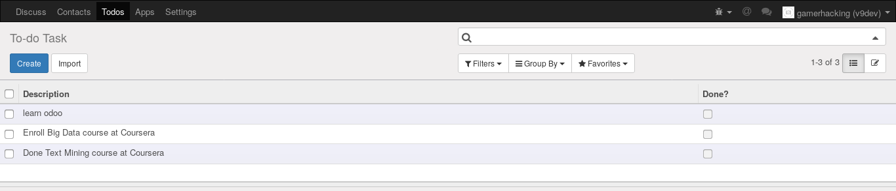
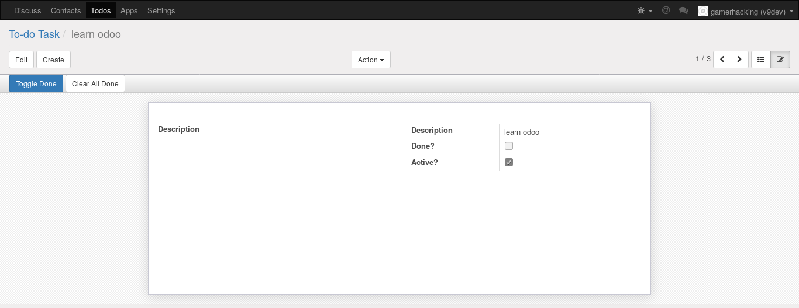
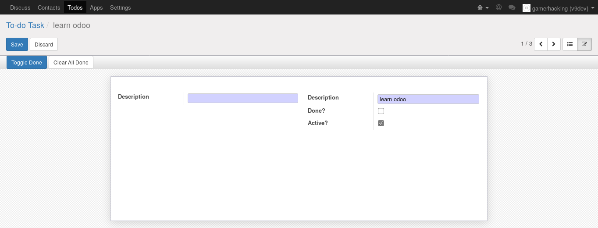

# learn-odoo

Learn odoo framework from basic. Use **Docker** for easier configuration and setup.

## Tutorials

1. [Setup host and tools](tutorial/1.setup-host.md)
	* [PostgreSQL](tutorial/1.1.postgresql.md)
	* [Docker](tutorial/1.2.docker.md)
	* [Server Configurations](tutorial/1.3.server-configurations.md)
	* [Samba](tutorial/1.4.samba.md)
	* [Third Party Modules](tutorial/1.5.third-party-modules.md)
	* [Activate developer mode](tutorial/1.6.activate-developer-mode.md)
	* [Database](tutorial/1.7.database.md)
2. [Essential concept and addons](tutorial/2.essential-concept-and-addons.md)
	* [Model layer](tutorial/2.1.model-layer.md)
	* [View layer](tutorial/2.2.view-layer.md)
	* [Business logic layer](tutorial/2.3.business-logic-layer.md)
	* [Access security](tutorial/2.4.access-security.md)
	* [Adding an icon to the module](tutorial/2.5.adding-icon-module.md)
	* Example: To-do Task Application:
		- Treeview
		
		- Record view
		
		- Form
		
3. [Inheritance](tutorial/3.inheritance.md)
	* [Extending model](tutorial/3.1.extending-model.md)
	* [Extending views](tutorial/3.2.extending-views.md)
	* [Extending tree and search views](tutorial/3.3.extending-tree-and-search-view.md)
	* [More to extend models](tutorial/3.4.more-to-extend-models.md)
	* [Add Social Network Features](tutorial/3.5.add-social-network-features.md)
	* [Modifying Data](tutorial/3.6.modifying-data.md)